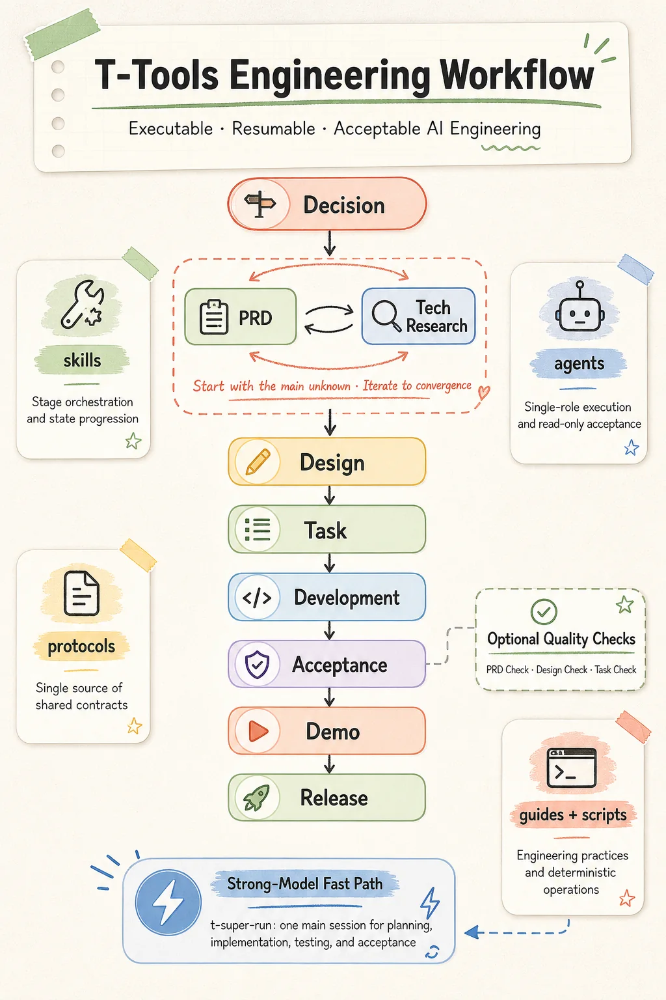

# T-Tools

[中文](README.md)

A Claude Code plugin for Rust, React, miniapp, and Flutter projects. It turns AI programming into an executable, resumable, and acceptable engineering workflow:

```text
Decision -> PRD / Tech Research (choose by the main unknown; iterate if needed) -> Design -> Task -> Development -> Acceptance -> Demo -> Release
```

T-Tools is designed for projects that already have a delivery chain across product documents, design, task breakdown, development, testing, and demos. Its focus is not freeform model execution. It uses skills to orchestrate stages, subagents to split work, protocols to keep shared contracts stable, and check / accept stages to close quality when needed.

Recommended first reading: [human/structure.en.md](human/structure.en.md) to understand how skills, subagents, and protocols work together. Before shaping a requirement, use [human/speech-template.en.md](human/speech-template.en.md) to speak through the real intent first.

The development log of this project's iterations is kept on [linux.do](https://linux.do/t/topic/1988118/4) (in Chinese).



## Quick Start

Not sure which command to start with? Run `t-how` — it explains the workflow for your goal and recommends the entry command.

Prerequisites:

- The plugin has been loaded by following [Installation](#installation)
- The target project has runtime directories: `docs/` and `.ai/`
- [`context7`](https://github.com/upstash/context7) is configured

Minimal end-to-end loop:

```bash
# Product decision gate
t-decision user-management

# Start with research when feasibility, dependency, or cost risks affect product scope
t-tech-research user-management

# Generate .ai/prd and .ai/user-stories drafts when product boundaries are ready;
# this may also run before research, then run again afterward to converge the drafts
t-prd user-management

# PRD quality check (optional; recommended for high-risk requirements)
t-prd-check user-management

# Generate technical design
t-design user-management

# Design quality check (optional; recommended for complex designs)
t-design-check user-management

# Generate executable backend tasks
t-task user-management --phase backend

# Check task breakdown, execution order, and executability (optional; recommended for complex plans)
t-task-check user-management --phase backend

# Implement and test by phase
t-run user-management --phase backend

# GPT-5.6 Sol-class path: let one main session plan, execute, and remain in
# Goal mode through implementation, validation, repair, and acceptance
t-super-run user-management --phase backend

# Run Web Demo/E2E tests
t-web-demo-run demo/e2e/<role>/<scenario>.e2e.ts

# Run all non-live Demo/E2E files sequentially with checkpoint resume
t-web-demo-run-all
# When many Demo files fail with overlapping causes: add scan to pre-scan, cluster by root cause, then fix each unique cause once
t-web-demo-run-all scan

# Run one Android Flutter user-story demo
t-flutter-demo-run patrol_test/<domain>/<story>_test.dart --device <android-id>

# Run all Patrol demos sequentially with checkpoint resume
t-flutter-demo-run-all --device <android-id>

# Web / Flutter Demo acceptance
t-web-demo-accept <role>
t-flutter-demo-accept <domain|all> --device <android-id>

# Publish formal PRD / user stories after implementation and acceptance
t-prd-publish user-management
```

`t-prd-check`, `t-design-check`, and `t-task-check` are optional quality checks. Run them for high-risk requirements, complex designs, multi-person work, long-lived changes, or unstable AI output; simple changes may continue directly to the next stage. `accept` remains the implementation acceptance closure and is separate from these optional checks.

## Phase Split

`t-task`, `t-task-check`, and `t-run` all progress by phase. A typical web order is `backend -> frontend -> web-demo`; a typical Flutter order is `backend -> flutter -> flutter-demo`.

- `backend`: backend APIs, data models, permissions, business logic, backend tests, and read-only acceptance.
- `frontend`: React pages, components, state, frontend tests, and read-only acceptance.
- `miniapp`: miniapp pages, platform capabilities, build verification, and read-only acceptance.
- `flutter`: Flutter views, Riverpod state, data layers, unit/widget/integration tests, and read-only acceptance.
- `web-demo`: Playwright Demo/E2E based on user stories and browser user paths.
- `flutter-demo`: Android Patrol demos based on user stories, including real App actions and native system UI.

Each phase starts with `t-task <feature> --phase <phase>`, may run `t-task-check <feature> --phase <phase>` depending on risk, and then `t-run <feature> --phase <phase>` executes items serially. Repeat the loop for every active phase.

`t-super-run <feature> --phase <backend|frontend|web-demo|flutter|flutter-demo>` is the single-main-session path for backend, frontend, Web Demo, Flutter, and Flutter Demo. It merges planning and execution: dev and test run in the main session under agent role guides, while accept dispatches the matching read-only accept subagent and maps its verdict back into the state, recording outcome-level status as `dev -> test -> accept` for backend/frontend/flutter or `dev -> accept` for web-demo/flutter-demo. `--phase` is required; each invocation executes exactly the one specified phase, then stops and reports the remaining unfinished phases for the user to start explicitly. Miniapp uses `t-task -> [t-task-check] -> t-run`.

## Key Rules

- Every `t-*` command is manually invoked; the model must not trigger them automatically.
- `t-decision` is the product decision gate before PRD and tech research; it routes to `t-prd` or `t-tech-research` by the main unknown.
- Consult `.ai/decision-log/<feature>.md` before asking the user anything; never re-ask a confirmed or already-decided question.
- A delivered PRD, tech research report, or design must have `needs_user_answer=0`. Questions that affect scope, business rules, permissions, security, significant cost, or acceptance are asked first, never silently stored as pending items, assumptions, or risks.
- `t-prd` and `t-tech-research` have no fixed order, but both must converge without unexplained conflicts before `t-design`; rerun `t-prd` when research findings change product semantics.
- `t-prd` only writes candidate drafts under `.ai/prd` and `.ai/user-stories`; `t-prd-publish` merges long-term facts back into `docs/`.
- `t-design` produces a master document plus per-stack designs: backend design runs first and owns the API contract; frontend and Flutter designs only consume it.
- Figma restoration and motion refinement are standalone entries outside the main chain: `t-figma-assets` prepares assets, `t-figma-impl` restores a full page, `t-figma-fix` refines one region, `t-figma-ux` polishes motion.
- Helper commands: `t-doc` for project documentation; `t-dream` for cross-stage read-only audits (PRD governance requires an explicit `--govern-prd`); `t-simplify` simplifies changed code, not correctness bugs. Before `t-push`, run `/code-review --fix` and `t-simplify` first; `t-push` then cleans comments, runs affected CI, commits, and pushes.

PRD, tech research, and design need explicit human calibration: speak through the real intent following [Do Not Shortcut the Intent](human/speech-template.en.md) first, and have the AI echo its key understanding and open questions before generating artifacts. After `t-prd`, state the PRD you would accept and let the AI revise against it; after `t-design`, walk the UX from the user's perspective — entry points, paths, feedback, defaults, and error states — before asking for revision.

## Installation

```bash
# 1. Clone this repository
git clone <repo-url>

# 2. Start Claude Code in the target project and load the plugin
cd /your-project
claude --plugin-dir /path/to/skills
```

Prerequisites:

- [Claude Code](https://docs.anthropic.com/en/docs/claude-code) CLI is installed and logged in
- MCP Server [`context7`](https://github.com/upstash/context7) is configured
- The official [Figma MCP Server](https://developers.figma.com/docs/figma-mcp-server/) is configured when using the Figma workflow
- `ffmpeg` and `ffprobe` are installed and available on PATH when converting Figma media assets

For tools that do not support `claude --plugin-dir` (Codex, ZCode, etc.), see [Using t-tools in Other AI Coding Tools](human/use-in-other-agents.en.md): place a dispatcher skill under `~/.agents/skills/` that routes `/t-tool <skill>` to the cloned repository directory.

## Projects Using This Plugin

- [Herald](https://github.com/timzaak/herald) — A multi-tenant authentication and authorization system
- [RMQTT-Things](https://github.com/timzaak/rmqtt-things) — An IoT thing-model management platform built on RMQTT
- [RWiki](https://github.com/timzaak/rwiki) — RAG-powered knowledge base Q&A in a single binary, zero external databases

> For Java backend support, see the `java` branch.
