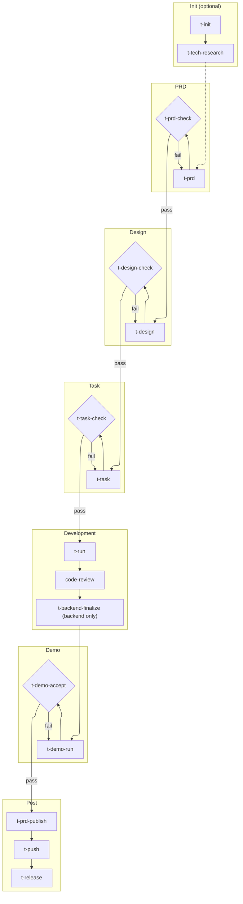

# T-Tools

[中文](README.md)

A Claude Code plugin for Rust + React projects. It turns `PRD -> Design -> Task -> Development -> Acceptance -> Demo` into a reusable workflow, so teams do not need to repeatedly design prompts, switch context manually, or maintain stage boundaries by hand.

It is designed for teams and projects that:

- Already have a clear delivery chain across product documents, design, task breakdown, development, testing, and demo delivery
- Want to move Claude Code from ad hoc Q&A to an executable engineering workflow
- Need subagent collaboration, stage gates, and standardized artifacts instead of one-off freeform execution

## Why Use It

- Fast adoption: follow the `/t-tools:t-*` command sequence directly, without designing a full prompt and collaboration system yourself
- Stable delivery: key stages include check and acceptance commands to reduce document drift, missed task breakdowns, and non-runnable demos
- Clear collaboration: skills, agents, guides, and protocols are layered for reuse across teams and long-running projects

## Design Overview

Recommended first reading: [human/structure.en.md](human/structure.en.md) — understand how skills, subagents, and protocols work together to drive AI programming.

## 3-Minute Quick Start

Prerequisites:

- The t-tools plugin has been loaded by following the [Installation](#installation) steps
- The target project has runtime directories: `docs/` and `.ai/`
- [`context7`](https://github.com/upstash/context7) is enabled

Minimal end-to-end example:

```bash
# Create or update the .ai/prd draft, then open HTML for review
/t-tools:t-prd user-management

# Quality gate: prevent upstream issues from entering the design stage
/t-tools:t-prd-check user-management

# Produce technical design from the PRD; pure technical designs may also use t-tech-research as input
/t-tools:t-design user-management

# Convert design into executable tasks
/t-tools:t-task user-management

# Check task breakdown, dependencies, and executability
/t-tools:t-task-check user-management --phase backend

# Drive implementation and testing by phase
/t-tools:t-run user-management --phase backend

# Code review
/code-review

# Finalize backend after backend acceptance
/t-tools:t-backend-finalize user-management

# Run Demo/E2E tests for the role
/t-tools:t-demo-run super-admin

# Final acceptance: verify story mapping, compilation, execution, and quality requirements
/t-tools:t-demo-accept super-admin

# After implementation and acceptance, summarize the draft and revise the formal PRD
/t-tools:t-prd-publish user-management
```

If you only remember one thing: do not skip check or accept stages. This plugin is not only for generating content. It is also designed to close each stage before problems flow downstream.

Additional notes:

- This README consistently uses `/t-tools:t-*` as the standard invocation format.
- All `t-*` skills in this plugin are manual command entries and must not be invoked automatically by the model.
- `t-doc` is for project documentation, onboarding tutorials, API references, configuration, and deployment notes. It is not for PRDs, technical designs, or small document edits.
- `t-dream` defaults to a read-only audit that reorganizes PRDs, user stories, design/task docs, implementation facts, and project structure, reducing stale, duplicated, conflicting, or misleading context; use `--govern-prd` explicitly when PRD governance should write changes.
- `t-backend-test-run` is an internal execution skill reused by flows such as `backend-test`; it is not recommended as a manual entry point.

## Full Workflow



Key behaviors:

- `t-prd` generates a temporary `.ai/prd` draft and Preview. It does not write directly into formal `docs/prd`.
- `t-prd-check` is the quality gate for PRDs, HTML Previews, and user stories. After it passes, continue to `t-design`; after fixes, run `t-prd-check` again.
- `t-prd-publish` runs after implementation, testing, and Demo acceptance. It summarizes the draft against the existing formal PRD and post-implementation evidence, fixes missing, stale, or conflicting content in `docs/prd`, then deletes the matching `.ai/prd` draft.
- `t-task-check` is the gate for task breakdown, DAG validity, and item executability. It verifies that task documents are ready for implementation.
- `t-demo-accept` is the demo-stage acceptance gate. It verifies test coverage, runnability, and delivery quality.

Helper commands:

- `t-init <project-name>`: initializes a full-stack project scaffold for Rust Axum + React TanStack, including backend, frontend, E2E tests, development scripts, and the complete directory structure
- `t-tech-research`: evaluates technical feasibility before writing the PRD, including dependency gap analysis, library research, impact analysis, and feasibility judgment; for pure technical designs that do not change business logic, it may be the direct upstream input to `t-design`
- `t-prd-publish <feature>`: after implementation and acceptance, reviews `.ai/prd/<domain>/<feature>.md`, the existing formal PRD, and post-implementation evidence, presents a publish summary, then fixes missing, stale, or conflicting content in `docs/prd/<domain>/<feature>.md` and deletes the draft
- `t-doc <project-or-module-name>`: scans the target project codebase and generates newcomer-oriented tutorial documentation under `docs/tutorials/<name>/` by default
- `t-html-show <feature | path>`: generates or updates HTML Preview for quick human review. Supports PRDs (pass feature name) and any Markdown document (pass file path). Usually triggered automatically by `t-prd`, but can also be run independently
- `t-dream [feature|--all] [--deep|--backend-only|--govern-prd]`: by default, read-only audits PRDs, user stories, design/task docs, code structure, tests/Demo, and implementation facts to find stale context, structure drift, traceability gaps, and description/implementation conflicts, then writes `.ai/quality/dream-check-[YYYYMMDD-HHMMSS].md`; only `--govern-prd` may rewrite PRDs, indexes, and references
- `t-demo-run-all`: runs demo tests in batch
- `t-push`: has the AI summarize the commit message from `git diff`, then calls `${CLAUDE_PLUGIN_ROOT}/scripts/push.py --message "<message>"` to detect backend, frontend, and demo changes, run affected local CI checks in parallel, and run `git commit` plus `git push` after CI passes
- `t-release [version]`: releases a version by updating project versions, creating a git commit and tag, and pushing to the remote. Version files use semantic versioning, such as `0.2.0`, while the final git tag always uses a `v` prefix, such as `v0.2.0`. If omitted, the command recommends one based on the latest semver tag. It only runs on a clean `main` branch, updates `backend/Cargo.toml`, `frontend/package.json`, and `demo/package.json`, then commits and pushes after compilation checks pass.

## Installation

```bash
# 1. Clone this repository
git clone <repo-url>

# 2. Start Claude Code in the target project and load the plugin
cd /your-project
claude --plugin-dir /path/to/skills
```

Prerequisites:

- [Claude Code](https://docs.anthropic.com/en/docs/claude-code) CLI is installed and logged in
- MCP Server [`context7`](https://github.com/upstash/context7) is configured for third-party library documentation lookup

## Projects Using This Plugin

- [Herald](https://github.com/timzaak/herald) — A multi-tenant authentication and authorization system (Rust Axum + SeaORM + PostgreSQL / React 19 + TanStack), providing auth services for both single-tenant and multi-tenant scenarios
- [RMQTT-Things](https://github.com/timzaak/rmqtt-things) — An IoT thing-model management platform built on RMQTT (Rust Axum + SQLx + PostgreSQL / React 19 + TanStack), with device management, command delivery, OTA firmware updates, and TLS certificate issuance
- [RWiki](https://github.com/timzaak/rwiki) — An AI-enhanced knowledge base built on Wiki.js data (Rust Axum + SQLx + PostgreSQL / React 19 + TanStack), with wiki content sync, semantic search, and intelligent Q&A
