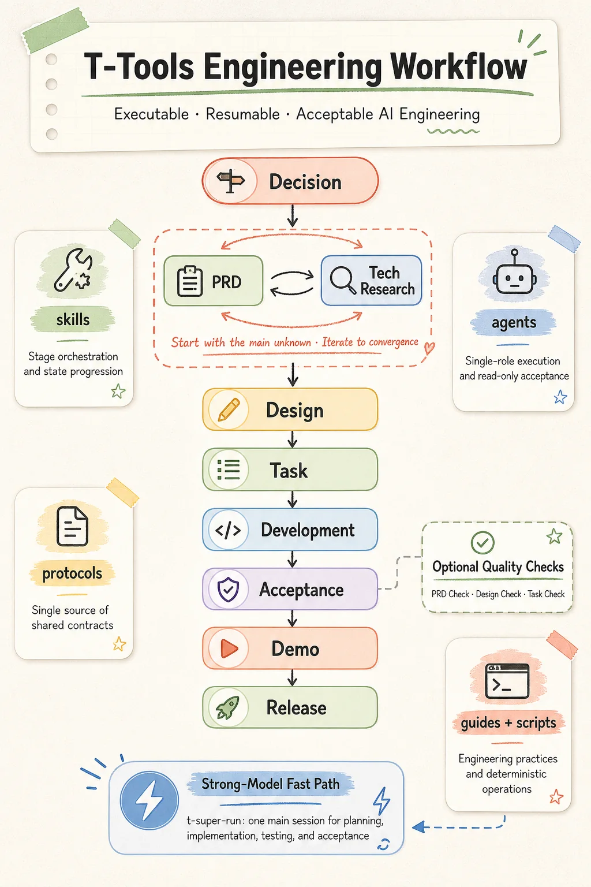

# T-Tools

[中文](README.md)

A Claude Code plugin for Rust, React, Chrome extension, miniapp, and Flutter projects. It turns AI programming into an executable, resumable, and acceptable engineering workflow:

```text
Decision -> PRD / Tech Research (choose by the main unknown; iterate if needed) -> Design -> Task -> Development -> Acceptance -> Demo -> Release
```

T-Tools is designed for projects that already have a delivery chain across product documents, design, task breakdown, development, testing, and demos. Its focus is not freeform model execution. It uses skills to orchestrate stages, subagents to split work, protocols to keep shared contracts stable, and check / accept stages to close quality when needed.

Recommended first reading: [human/structure.en.md](human/structure.en.md) to understand how skills, subagents, and protocols work together. Before shaping a requirement, use [human/speech-template.en.md](human/speech-template.en.md) to speak through the real intent first.

The development log of this project's iterations is kept on [linux.do](https://linux.do/t/topic/1988118/4) (in Chinese).



## Quick Start

Not sure which command to start with? Run `t-how` — it explains the workflow for your goal and recommends the entry command.

Follow [Installation](#installation) and meet its prerequisites first.

Minimal end-to-end loop:

```bash
# Product decision gate; routes to tech research or PRD by the main unknown
t-decision user-management

# Run research first when feasibility, dependencies, or cost may affect scope;
# no fixed order with PRD — converge before design
t-tech-research user-management

# Read the feature's Decision Brief and tech research first; review existing related PRDs
# Generate .ai/prd and .ai/user-stories drafts
t-prd user-management

# Run t-prd-check by risk, or proceed directly to design
# Generate technical design (master + per-stack)
t-design user-management

# Merge task planning, implementation, and testing per phase; repeat the loop for other phases
t-super-run user-management --phase backend

# Web Demo/E2E and final acceptance (extensions and Flutter have separate commands)
t-web-demo-run demo/e2e/<role>/<scenario>.e2e.ts
t-web-demo-accept <role>
# Chrome extension loaded-browser demo and acceptance
t-extension-demo-run demo/e2e/extension/<scenario>.e2e.ts
t-extension-demo-run-all
t-extension-demo-accept all

# Publish formal PRD / user stories after implementation and acceptance
t-prd-publish user-management
```

`t-prd-check`, `t-design-check`, and `t-task-check` are optional quality checks; use them by risk.

## Phase Split

A typical web order is `backend -> frontend -> web-demo`; a typical extension order is `extension -> extension-demo` (with backend first when changed); a typical Flutter order is `backend -> flutter -> flutter-demo`.

- `backend`: backend APIs, data models, permissions, business logic, backend tests, and read-only acceptance.
- `frontend`: React pages, components, state, frontend tests, and read-only acceptance.
- `extension`: WXT / Chrome MV3 entrypoints, messaging, storage, permissions, Vitest tests, and read-only acceptance.
- `miniapp`: miniapp pages, platform capabilities, build verification, and read-only acceptance.
- `flutter`: Flutter views, Riverpod state, data layers, unit/widget/integration tests, and read-only acceptance.
- `web-demo`: Playwright Demo/E2E based on user stories and browser user paths.
- `extension-demo`: Playwright integration demos with a loaded extension, covering user paths across contexts, permissions, and lifecycle behavior.
- `flutter-demo`: Android Patrol demos based on user stories, including real App actions and native system UI.

Each phase uses `t-super-run` by default: the main session implements, tests, and repairs the work under the current role specification, while accept dispatches a read-only subagent for independent acceptance. `--phase` is required; each call executes one phase and stops, and repeating the same command recovers after an interruption. Use `t-task -> t-run` when plans need separate review or fine-grained item ownership; the two workflows keep independent state.

When review fixes, cleanup, or CI repairs invalidate evidence, required regressions and independent acceptance run before committing; see the [push execution contract](protocols/push-execution-contract.md) for push gates and interrupted-push recovery.

Prepare a WXT project using the [extension initialization guide](guides/extension/initialization.md); run `t-init --extension-demo` in the target project to add real-extension integration-demo infrastructure. See the [extension demo guide](guides/extension/demo-testing.md) for fixtures, environment selection, and acceptance.

## Usage Rules

- Every `t-*` command is manually invoked; the model must not trigger them automatically.
- Not sure which command to use, or how a stage runs? Run `t-how`: it routes by goal and explains preconditions, outputs, and next steps.
- PRD, tech research, and design need explicit human calibration: speak through the real intent with [Do Not Shortcut the Intent](human/speech-template.en.md) first, and never deliver with unconfirmed questions left open.

## Installation

```bash
# 1. Clone this repository
git clone <repo-url>

# 2. Start Claude Code in the target project and load the plugin
cd /your-project
claude --plugin-dir /path/to/skills
```

Prerequisites:

- MCP Server [`context7`](https://github.com/upstash/context7) is configured
- Chrome DevTools MCP (with `--autoConnect`) is configured per the [live Chrome debugging guide](guides/extension/live-browser.md) when extension work touches the user's live Chrome (tabs, login state, installed extensions)
- The official [Figma MCP Server](https://developers.figma.com/docs/figma-mcp-server/) and Chrome DevTools MCP are configured when using the Figma workflow; asset conversion depends on `ffmpeg`/`ffprobe`, `svgo`, and the [kyz](https://github.com/timzaak/kyz) credential proxy

The runtime directories `.ai/` and `docs/` are created automatically during execution — no need to create them up front.

For tools that do not support `claude --plugin-dir` (Codex, ZCode, etc.), see [Using t-tools in Other AI Coding Tools](human/use-in-other-agents.en.md): place a dispatcher skill under `~/.agents/skills/` that routes `/t-tool <skill>` to the cloned repository directory.

## Projects Using This Plugin

- [Herald](https://github.com/timzaak/herald) — A multi-tenant authentication and authorization system
- [RMQTT-Things](https://github.com/timzaak/rmqtt-things) — An IoT thing-model management platform built on RMQTT
- [RWiki](https://github.com/timzaak/rwiki) — RAG-powered knowledge base Q&A in a single binary, zero external databases
- [OnceWise](https://github.com/timzaak/OnceWise) — An intelligent form-automation assistant that ends repetitive form filling

> For Java backend support, see the `java` branch.
