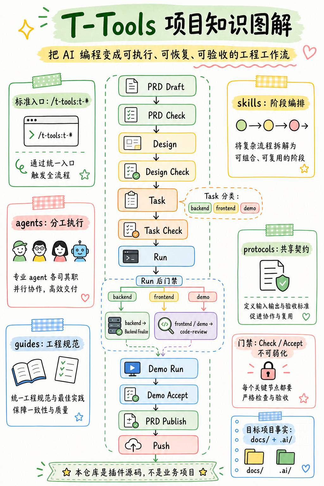

# T-Tools

[English](README.en.md)

面向 Rust + React 项目的 Claude Code plugin。它把 `PRD -> 设计 -> 任务 -> 开发 -> 验收 -> Demo` 串成一套可复用工作流，让你不用反复设计 prompt、切换上下文或手工维护阶段边界。

适合这类团队和项目：

- 已经有明确的产品文档、设计、任务拆解、开发、测试、Demo 交付链路
- 希望把 Claude Code 从"临时问答"升级成"可执行的工程工作流"
- 需要 sub-agent 分工、阶段门禁、标准化产物，而不是一次性自由发挥

## 为什么用它

- 上手快：直接按 `/t-tools:t-*` 命令顺序推进，不需要自己设计整套提示词和协作流程
- 交付稳：关键阶段自带检查和验收命令，减少文档跑偏、任务漏拆、Demo 不可执行
- 协作清：skill、agent、guide、protocol 已分层，适合多人或长期项目持续复用

## 设计思路导读

推荐先读 [human/structure.md](/human/structure.md)，理解 skill、subagent、protocol 如何协同驱动 AI 编程。



## 3 分钟快速上手

前置条件：

- 已按下方 [安装](#安装) 步骤加载 t-tools 插件
- 目标项目具备运行时目录：`docs/`、`.ai/`
- 已启用 [`context7`](https://github.com/upstash/context7)

最短闭环示例：

```bash
# 创建或更新 .ai/prd 草稿，并打开 HTML 供审阅
/t-tools:t-prd user-management

# 质量门禁：避免把问题带入设计阶段
/t-tools:t-prd-check user-management

# 基于 PRD 产出技术设计；纯技术方案也可基于 t-tech-research 产出
/t-tools:t-design user-management

# 把设计转换成可执行任务
/t-tools:t-task user-management

# 检查任务拆分、依赖和可执行性
/t-tools:t-task-check user-management --phase backend

# 按阶段驱动实现与测试
/t-tools:t-run user-management --phase backend

# 代码审查
/code-review

# 后端验收后执行收口
/t-tools:t-backend-finalize user-management

# 运行该角色的 Demo/E2E 测试
/t-tools:t-demo-run super-admin

# 最终验收：确认故事映射、编译、执行和质量要求都通过
/t-tools:t-demo-accept super-admin

# 实现与验收完成后，基于草稿做发布总结并修正正式 PRD
/t-tools:t-prd-publish user-management
```

如果你只想记住一件事：不要跳过 check / accept 阶段。这个 plugin 的价值不只是"帮你生成内容"，而是"帮你在每个阶段收口"。

补充说明：

- 本 README 统一使用 `/t-tools:t-*` 作为标准调用形式
- 本插件所有 `t-*` skill 均为手工触发入口，不允许模型根据语义自动触发
- `t-doc` 用于项目文档、上手教程、API 参考、配置和部署说明，不用于 PRD、技术设计或只改某个文档片段
- `t-dream` 默认以只读 audit 方式整理 PRD、用户故事、设计/任务、实现事实与项目结构，减少过期、重复、冲突和误导性上下文累积；需要写入 PRD 治理时显式使用 `--govern-prd`
- `t-backend-test-run` 是内部执行型 skill，供 `backend-test` 等流程复用，不作为推荐的手动入口

## 安装

```bash
# 1. 克隆本仓库
git clone <repo-url>

# 2. 在目标项目中启动 Claude Code 并加载插件
cd /your-project
claude --plugin-dir /path/to/skills
```

前置依赖：

- [Claude Code](https://docs.anthropic.com/en/docs/claude-code) CLI 能正常使用
- MCP Server [`context7`](https://github.com/upstash/context7) 已配置（用于查询第三方库文档）

## 使用本插件的项目

- [Herald](https://github.com/timzaak/herald) — 多租户认证与授权系统（Rust Axum + SeaORM + PostgreSQL / React 19 + TanStack），支持单租户与多租户场景的认证服务
- [RMQTT-Things](https://github.com/timzaak/rmqtt-things) — 基于 RMQTT 的物联网物模型管理平台（Rust Axum + SQLx + PostgreSQL / React 19 + TanStack），支持设备管理、命令下发、OTA 升级与 TLS 证书签发
- [RWiki](https://github.com/timzaak/rwiki) — 基于 Wiki.js 数据的 AI 增强知识库（Rust Axum + SQLx + PostgreSQL / React 19 + TanStack），支持 Wiki 内容同步、语义搜索与智能问答

> Java 后端支持见 `java` 分支。
