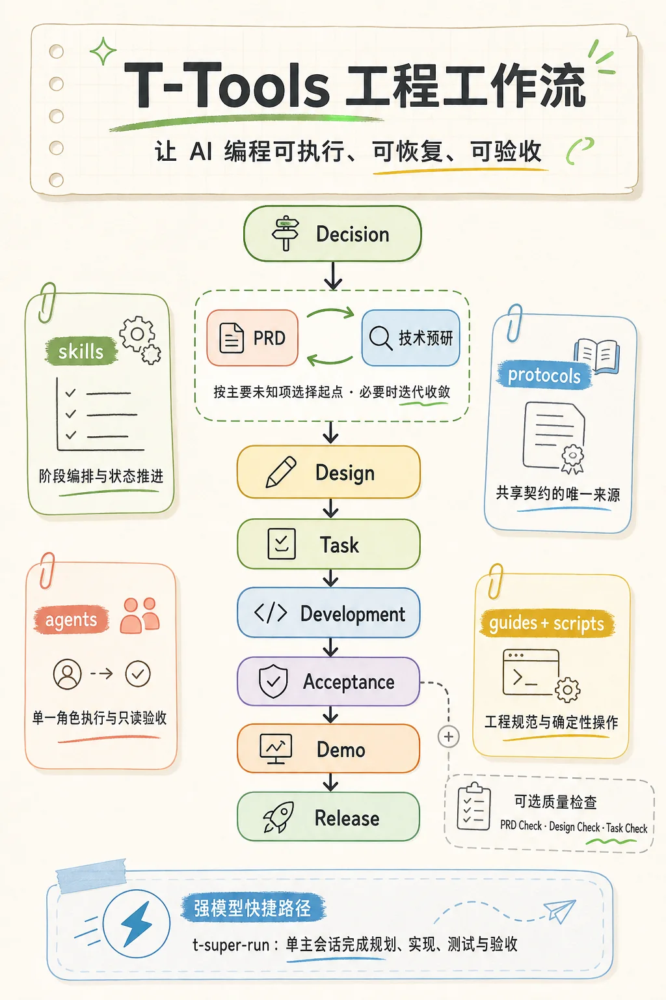

# T-Tools

[English](README.en.md)

面向 Rust、React、Chrome 扩展、小程序与 Flutter 项目的 Claude Code plugin。它把 AI 编程拆成一套可执行、可恢复、可验收的工程工作流：

```text
Decision -> PRD / 技术预研（按主要未知项选择，可回环）-> 设计 -> 任务 -> 开发 -> 验收 -> Demo -> 发布
```

T-Tools 适合已经有产品文档、设计、任务拆解、开发、测试和 Demo 交付链路的项目。它的重点不是让模型自由发挥，而是用 skill 编排阶段、用 subagent 分工执行、用 protocol 固化共享契约，并在需要时用 check / accept 阶段收口质量。

测试默认围绕后端场景和用户故事 Demo 规划；只有这些测试难稳定覆盖重要规则或边界时才新增局部测试。需要测试角色编写测试用例或专项验证脚本时才规划 test slot；运行现有测试、类型检查和构建归 dev，accept 核查证据。

业务行为变更必须有运行验证，或明确交给后续阶段并报告“业务验收待完成”；编译通过不能替代业务结果。小程序复用已有自动化或开发者工具/真机验证；扩展按实际覆盖缺口接入 Vitest，不默认补冒烟单测。同角色的小测试闭环可合并编写与运行，backend/test 保留 authoring/runner 分工。accept 独立审查并可复用仍有效的运行证据，输入变化或证据不足时补跑；详见 [验证证据协议](protocols/verification-evidence-contract.md)。

推荐先读 [human/structure.md](human/structure.md)，理解 skill、subagent、protocol 如何协同；做需求前可用 [human/speech-template.md](human/speech-template.md) 先口述一遍真实意图。

本项目迭代的开发日志记录在 [linux.do](https://linux.do/t/topic/1988118/4)。



## 快速上手

不知道从哪个命令开始时，运行 `t-how`：它按你的目标讲解工作流并推荐入口命令。

按 [安装](#安装) 加载插件并满足前置条件后，最短闭环：

```bash
# 产品立项判断，按主要未知项进入技术预研或 PRD
t-decision user-management

# 技术可行性、依赖或成本影响产品范围时先做预研；与 PRD 无固定顺序，进设计前收敛
t-tech-research user-management

# 生成 .ai/prd 与 .ai/user-stories 草稿
t-prd user-management

# 生成技术设计（主文档 + 分端设计）
t-design user-management

# 生成任务并按 phase 实现与测试；其他 phase 重复同样闭环
t-task user-management --phase backend
t-run user-management --phase backend

# GPT-5.6 Sol 级强模型的单主会话路径，合并规划与执行
t-super-run user-management --phase backend

# Web Demo/E2E 与最终验收（扩展、Flutter 有独立入口）
t-web-demo-run demo/e2e/<role>/<scenario>.e2e.ts
t-web-demo-accept <role>
# Chrome 扩展真实加载演示与验收
t-extension-demo-run demo/e2e/extension/<scenario>.e2e.ts
t-extension-demo-run-all
t-extension-demo-accept all

# 实现和验收后发布正式 PRD / 用户故事
t-prd-publish user-management
```

`t-prd-check`、`t-design-check`、`t-task-check` 是可选质量检查，按风险选用。

## 阶段拆分

典型 Web 顺序是 `backend -> frontend -> web-demo`；典型扩展顺序是 `extension -> extension-demo`（有后端改动时前置 backend）；典型 Flutter 顺序是 `backend -> flutter -> flutter-demo`。

- `backend`：后端接口、数据模型、权限、业务逻辑、后端测试和只读验收。
- `frontend`：React 页面、组件、状态、前端测试和只读验收。
- `extension`：WXT / Chrome MV3 入口、消息、存储、权限、Vitest 测试和只读验收。
- `miniapp`：小程序页面、平台能力、构建验证和只读验收。
- `flutter`：Flutter View、Riverpod 状态、数据层、单元/widget/integration 测试和只读验收。
- `web-demo`：基于用户故事维护 Playwright Demo/E2E，并验收浏览器用户路径。
- `extension-demo`：基于用户故事维护真实加载扩展的 Playwright 集成演示，验收跨上下文用户路径、权限和生命周期。
- `flutter-demo`：基于用户故事维护 Android Patrol 演示，覆盖真实 App 操作与原生系统 UI。

每个 phase 的闭环是 `t-task -> [t-task-check]（可选，按风险）-> t-run`，快速上手只以 backend 为例，其余 phase 重复同样闭环。`t-super-run` 是 GPT-5.6 Sol 级强模型的单主会话路径：合并规划与执行，`--phase` 必填，每次调用只执行一个 phase，完成后停止；全部 supported phase（含 extension 和 miniapp）均可走该路径。

扩展项目按 [扩展初始化指南](guides/extension/initialization.md) 准备 WXT 工程（已有工程跳过；`t-init` 尚无扩展模板）。需求来源齐备后，运行 `t-design <feature>`、`t-task <feature> --phase extension`、`t-run <feature> --phase extension`；设计要求用户故事演示时再运行 `t-task <feature> --phase extension-demo` 和 `t-run <feature> --phase extension-demo`。设计独立输出 `extension.md`；演示 fixture、环境与验收按 [扩展演示指南](guides/extension/demo-testing.md)。

## 使用规则

扩展开发需要读取用户当前 Chrome 的标签页、登录态或已安装扩展时，统一使用 **Chrome DevTools MCP + `--autoConnect`**。按 [用户 Chrome 调试指南](guides/extension/live-browser.md) 配置 Claude Code、Codex 或 ZCode，并在 Chrome 中允许连接。该服务仅为现场任务的条件依赖，不加入全局必需 MCP；现场证据与独立 Playwright 回归分别验收。

- 所有 `t-*` 命令都需手工触发，模型不得自动调用。
- 不确定用哪个命令、想了解某阶段怎么跑时，运行 `t-how`：它按目标路由并讲解前置条件、产物和下一步。
- PRD、技术预研和设计需要人的明确校准：先按 [莫要偷懒](human/speech-template.md) 口述真实意图，交付时不得遗留未向用户确认的问题。

## 安装

```bash
# 1. 克隆本仓库
git clone <repo-url>

# 2. 在目标项目中启动 Claude Code 并加载插件
cd /your-project
claude --plugin-dir /path/to/skills
```

前置条件：

- [Claude Code](https://docs.anthropic.com/en/docs/claude-code) CLI 能正常使用
- MCP Server [`context7`](https://github.com/upstash/context7) 已配置
- 使用 Figma 工作流时，官方 [Figma MCP Server](https://developers.figma.com/docs/figma-mcp-server/) 与 Chrome DevTools MCP 已配置（后者用于验收目视比对）
- 使用 Figma 素材转换时，`ffmpeg` 与 `ffprobe` 已安装并可从 PATH 调用；SVG 优化还需要 `svgo`（`npm install -g svgo`）
- `t-figma-assets` 的 PNG 转 WebP 依赖 [kyz](https://github.com/timzaak/kyz) 凭据代理：需 `kyz daemon start` 并配置 tinify 规则（tinify 凭据存入 vault，方法见 kyz 仓库 `docs/proxy.md`），TinyPNG API key 不落本仓库

`t-figma-assets` 根据节点信息和转换脚本结果处理素材，不逐张目视检查；页面视觉比对由后续实现与验收阶段完成。

`.ai/` 与 `docs/` 运行时目录无需预先创建，工作流执行过程中会自行创建。`docs/` 可能已被你用于其它事情：t-tools 只写入自己的固定文档路径（`docs/prd/`、`docs/user-stories/`、`docs/design/` 等），不改动其中的无关内容。

使用 Codex、ZCode 等不支持 `claude --plugin-dir` 的工具时，见 [在其它 AI 编程工具中使用 t-tools](human/use-in-other-agents.md)：通过在 `~/.agents/skills/` 下放置路由 skill，把 `/t-tool <skill>` 指向克隆后的仓库目录。

## 使用本插件的项目

- [Herald](https://github.com/timzaak/herald) — 多租户认证与授权系统
- [RMQTT-Things](https://github.com/timzaak/rmqtt-things) — 基于 RMQTT 的物联网物模型管理平台
- [RWiki](https://github.com/timzaak/rwiki) — 基于 RAG 的知识库问答，单二进制、零外部数据库

> Java 后端支持见 `java` 分支。
