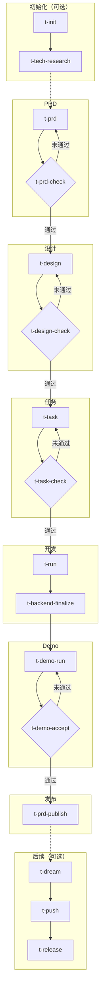

# T-Tools

[English](README.en.md)

面向 Rust + React 项目的 Claude Code plugin。它把 `PRD -> 设计 -> 任务 -> 开发 -> 验收 -> Demo` 串成一套可复用工作流，让你不用反复设计 prompt、切换上下文或手工维护阶段边界。

适合这类团队和项目：

- 已经有明确的产品文档、设计、任务拆解、开发、测试、Demo 交付链路
- 希望把 Claude Code 从"临时问答"升级成"可执行的工程工作流"
- 需要 sub-agent 分工、阶段门禁、标准化产物，而不是一次性自由发挥

## 为什么用它

- 上手快：直接按 `/t-tools:t-*` 命令顺序推进，不需要自己设计整套提示词和协作流程
- 交付稳：关键阶段自带检查和验收命令，减少文档跑偏、任务漏拆、Demo 不可执行
- 协作清：skill、agent、guide、protocol 已分层，适合多人或长期项目持续复用

## 设计思路导读

推荐先读 [human/structure.md](/human/structure.md)，理解 skill、subagent、protocol 如何协同驱动 AI 编程。

## 3 分钟快速上手

前置条件：

- 已按下方 [安装](#安装) 步骤加载 t-tools 插件
- 目标项目具备运行时目录：`docs/`、`.ai/`
- 已启用 `context7`

最短闭环示例：

```bash
# 创建或更新 .ai/prd 草稿，并打开 HTML 供审阅
/t-tools:t-prd user-management

# 质量门禁：避免把问题带入设计阶段
/t-tools:t-prd-check user-management

# 基于 PRD 产出技术设计；纯技术方案也可基于 t-tech-research 产出
/t-tools:t-design user-management

# 把设计转换成可执行任务
/t-tools:t-task user-management

# 检查任务拆分、依赖和可执行性
/t-tools:t-task-check user-management --phase backend

# 按阶段驱动实现与测试
/t-tools:t-run user-management --phase backend

# 后端验收后执行收口
/t-tools:t-backend-finalize user-management

# 运行该角色的 Demo/E2E 测试
/t-tools:t-demo-run super-admin

# 最终验收：确认故事映射、编译、执行和质量要求都通过
/t-tools:t-demo-accept super-admin

# 实现与验收完成后，基于草稿做发布总结并修正正式 PRD
/t-tools:t-prd-publish user-management
```

如果你只想记住一件事：不要跳过 check / accept 阶段。这个 plugin 的价值不只是"帮你生成内容"，而是"帮你在每个阶段收口"。

补充说明：

- 本 README 统一使用 `/t-tools:t-*` 作为标准调用形式
- 本插件所有 `t-*` skill 均为手工触发入口，不允许模型根据语义自动触发
- `t-doc` 用于项目文档、上手教程、API 参考、配置和部署说明，不用于 PRD、技术设计或只改某个文档片段
- `t-dream` 默认以只读 audit 方式整理 PRD、用户故事、设计/任务、实现事实与项目结构，减少过期、重复、冲突和误导性上下文累积；需要写入 PRD 治理时显式使用 `--govern-prd`
- `t-backend-test-run` 是内部执行型 skill，供 `backend-test` 等流程复用，不作为推荐的手动入口

## 完整工作流



关键行为：

- `t-prd` 生成 `.ai/prd` 临时草稿和 Preview，不直接写入正式 `docs/prd`
- `t-prd-check` 是 PRD、HTML Preview 与 user story 质量门禁；通过后进入 `t-design`，若有修复则再次运行 `t-prd-check`
- `t-prd-publish` 在实现、测试、Demo 验收完成后，基于草稿、现有正式 PRD 和实现后证据做发布总结，修正 `docs/prd` 中缺失、过期或冲突的问题，完成后删除对应 `.ai/prd` 草稿
- `t-task-check` 是任务拆分、DAG 和 item 可执行性门禁，用来确认任务文档可进入实施
- `t-demo-accept` 是 Demo 阶段验收门禁，用来确认测试覆盖、可运行性和交付质量

辅助命令：

- `t-init <project-name>`：初始化全栈项目骨架（Rust Axum + React TanStack），生成后端、前端、E2E 测试、开发脚本等完整目录结构
- `t-tech-research`：在写 PRD 之前评估需求的技术可行性，包括依赖缺口分析、库调研、影响分析和可行性判定；不涉及业务逻辑变动的纯技术方案可作为 `t-design` 的直接上游输入
- `t-prd-publish <feature>`：实现与验收完成后，审核 `.ai/prd/<domain>/<feature>.md`、既有正式 PRD 和实现后证据的差异，先输出发布总结，确认后修正 `docs/prd/<domain>/<feature>.md` 中缺失、过期或冲突的问题并删除草稿
- `t-doc <project-or-module-name>`：扫描目标项目代码库，生成面向新人的教程文档，默认写入 `docs/tutorials/<name>/`
- `t-html-show <feature | path>`：独立生成或更新文档的 HTML Preview，供人类快速审阅。支持 PRD（传 feature 名称）和任意 Markdown 文档（传文件路径）。通常由 `t-prd` 自动触发，也可单独执行
- `t-dream [feature|--all] [--deep|--backend-only|--govern-prd]`：默认只读审计 PRD、用户故事、设计/任务、代码结构、测试/Demo 与实现事实，发现过期上下文、结构漂移、traceability 断链和描述/实现冲突，并输出 `.ai/quality/dream-check-[YYYYMMDD-HHMMSS].md`；`--govern-prd` 才允许改写 PRD、索引和引用
- `t-demo-run-all`：批量执行 Demo 测试
- `t-push`：由 AI 基于 git diff 总结 commit message，再调用 `${CLAUDE_PLUGIN_ROOT}/scripts/push.py --message "<message>"` 自动判断 backend、frontend、demo 变更范围，并发运行受影响区域的本地 CI；CI 全部通过后执行 `git commit` 和 `git push`
- `t-release [版本号]`：版本发布，更新项目版本号、创建 git commit 和 tag、推送到远程。版本文件使用语义化版本（如 `0.2.0`），最终 git tag 一律使用 `v` 前缀（如 `v0.2.0`）；留空则基于最新 semver tag 推荐。仅在 `main` 分支且工作区干净时执行，自动更新 `backend/Cargo.toml`、`frontend/package.json`、`demo/package.json`，编译验证通过后提交并推送

## 安装

```bash
# 1. 克隆本仓库
git clone <repo-url>

# 2. 在目标项目中启动 Claude Code 并加载插件
cd /your-project
claude --plugin-dir /path/to/skills
```

前置依赖：

- [Claude Code](https://docs.anthropic.com/en/docs/claude-code) CLI 已安装并登录
- MCP Server `context7` 已配置（用于查询第三方库文档）

## 使用本插件的项目

- [Herald](https://github.com/timzaak/herald) — 多租户认证与授权系统（Rust Axum + SeaORM + PostgreSQL / React 19 + TanStack），支持单租户与多租户场景的认证服务
- [RMQTT-Things](https://github.com/timzaak/rmqtt-things) — 基于 RMQTT 的物联网物模型管理平台（Rust Axum + SQLx + PostgreSQL / React 19 + TanStack），支持设备管理、命令下发、OTA 升级与 TLS 证书签发
- [RWiki](https://github.com/timzaak/rwiki) — 基于 Wiki.js 数据的 AI 增强知识库（Rust Axum + SQLx + PostgreSQL / React 19 + TanStack），支持 Wiki 内容同步、语义搜索与智能问答

## 依赖

- `Context7`：供 `backend-dev`、`backend-test`、`frontend-dev`、`frontend-test` 查询第三方库文档
