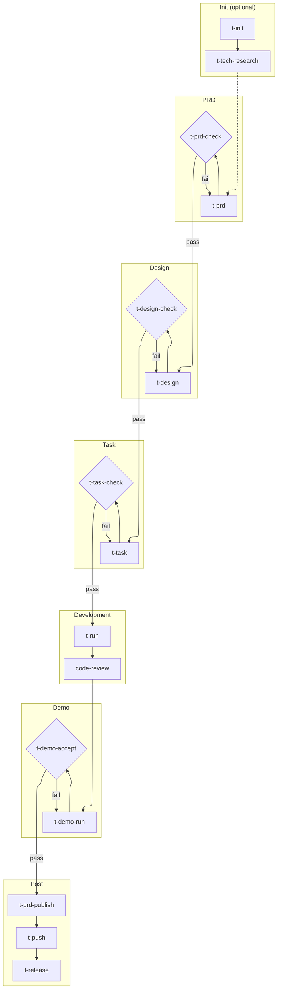

# Skill and Subagent Design in T-Tools

T-Tools is not a loose collection of prompts. It is an AI programming workflow designed for engineering delivery. Its goal is to constrain Claude Code from an ad hoc Q&A tool into an executable, recoverable, and verifiable collaboration system.

The core idea can be summarized as:

- `skills/` handles workflow orchestration.
- `agents/` handles specialized execution.
- `protocols/` handles shared contracts.
- `guides/` handles engineering standards.
- `.ai/` and `docs/` handle runtime artifacts and business facts in the target project.

## Four-Layer Structure

### Skills: Workflow Controllers

A skill is an imperative workflow entry point, organized by workflow stage:

**Init (optional):**

- `t-init`: initializes a full-stack project scaffold.
- `t-tech-research`: evaluates technical feasibility.

**PRD:**

- `t-prd`: generates or updates the PRD draft and Preview.
- `t-prd-check`: PRD quality gate.
- `t-html-show`: converts Markdown documents into HTML Previews for human review.

**Design:**

- `t-design`: produces technical design from the PRD.
- `t-design-check`: design quality gate.

**Task:**

- `t-task`: converts design into executable tasks.
- `t-task-check`: task breakdown quality gate.

**Development:**

- `t-run`: drives implementation and testing by phase.
- `code-review`: code review (shared across frontend, backend, and demo).
- `t-backend-test-run`: internal execution skill, reused by workflows.

**Demo:**

- `t-demo-run`: runs Demo/E2E tests.
- `t-demo-run-all`: runs demo tests in batch.
- `t-demo-accept`: demo acceptance gate.

**Publish:**

- `t-prd-publish`: summarizes the draft and revises the formal PRD.

**Post (optional):**

- `t-dream`: context cleanup and structure drift governance.
- `t-doc`: generates project tutorial documentation.
- `t-push`: local CI closure, then commit and push.
- `t-release`: version release.

The responsibility of a skill is not to "write a prompt and let the model improvise." Its responsibility is to control stage progression:

- Validate inputs and prerequisites.
- Read upstream documents and state.
- Dispatch the appropriate subagent.
- Write standardized artifacts.
- Update task state.
- Provide a recoverable path when failures occur.

In this sense, a skill is closer to a lightweight workflow engine.

### Agents: Specialized Executors

Subagents are split by engineering role:

**Backend:**

- `backend-dev`: implements Rust backend features.
- `backend-test`: handles backend scenario tests, integration tests, and acceptance tests.
- `backend-accept`: performs read-only backend acceptance.

**Frontend:**

- `frontend-dev`: implements the React frontend.
- `frontend-test`: handles Vitest, Testing Library, and MSW tests.
- `frontend-accept`: performs read-only frontend acceptance.

**Miniapp:**

- `miniapp-dev`: implements miniapp features.
- `miniapp-test`: handles miniapp tests.
- `miniapp-accept`: performs read-only miniapp acceptance.

**Demo:**

- `demo-dev`: maintains independent Playwright demo/E2E tests based on user stories.
- `demo-accept`: verifies whether demo tests align with user stories, execution results, and test quality expectations.
- `demo-diagnose`: diagnoses demo test failures and identifies the responsible party.

**Quality audit:**

- `context-curator`: read-only audit for duplicated, stale, conflicting, process-heavy, or non-authoritative information across PRDs, user stories, design docs, tasks, and demo comments.
- `structure-review`: read-only assessment of PRD directories, code directories, module boundaries, test layout, demo layout, and `.ai/` runtime artifact organization.
- `backend-consistency`: performs backend module-level deep consistency checks, comparing PRD against implementation across five dimensions: API capability boundaries, data models, validation rules, permissions, and business logic.

**Utility:**

- `html-show`: converts Markdown documents into HTML Previews. Applicable to PRDs and any document.

The key point of this split is responsibility boundaries. Development agents may modify code; test agents focus on tests; acceptance agents are read-only by default and produce evidence-based reports. When something fails, the workflow hands off to the appropriate role instead of making one agent own every responsibility at once.

### Protocols: Shared Contracts

`protocols/` is the single source of truth shared across skills and agents. It defines:

- The state structure of `.ai/task/[feature]/.state.json`.
- The execution order of `phase -> slot -> item`.
- Structured output when an agent completes or fails.
- The `tests_to_run` set that must be returned after a fix.
- The file location, content model, technology boundary, and check scope for PRD HTML Previews.
- Scoring and blocking rules for PRD, design, and task checks.
- The structure and severity rules for t-dream audit reports.
- Backend test execution contracts and diagnostic report formats.

This avoids having every skill or agent redefine its own fields, state machine, and quality criteria. When a shared rule needs to change, the protocol should be updated first instead of copying the same change across multiple agent documents.

### Guides: Engineering Standards

`guides/` contains concrete engineering standards, organized by domain:

- `backend/`: backend architecture, development, testing, validation, TDD workflow, and quality gates.
- `frontend/`: frontend development patterns, design patterns, testing strategy, `data-testid` standards, validation, and quality gates.
- `miniapp/`: miniapp development, testing, validation, AI rules, and quality gates.
- `demo/`: E2E testing, selector strategy, Page Objects, diagnostics, and common failure handling.
- `product/`: product documentation and user story standards.
- `core/`: environment configuration and general quality standards.

Agent documents only describe when to read these guides, how to execute the work, and what to return. They do not duplicate the rules inside the guides. This reduces rule drift.

## Workflow from PRD to Delivery

The recommended full T-Tools path:



This path breaks AI programming into product definition, design, task planning, implementation, testing, acceptance, demo delivery, and publishing. Every stage has an input contract, an output contract, and quality gates. Diamond nodes are quality gates that loop back on failure; dashed lines indicate optional paths.

The important point is not to skip check or acceptance steps. The value of this project is not only content generation. It is also the ability to close each stage before upstream problems flow downstream.

## t-prd Design: Make AI Output Understandable First

The core change in `t-prd` is not "generate one more HTML file." It changes how humans review AI output.

In a traditional PRD flow, AI can easily produce a thousand lines of Markdown. That structure may be clear to the model, but it is expensive for humans to read: they have to hunt through a long document for the goal, scope, flow, states, permissions, exceptions, and acceptance criteria, then judge whether those pieces contradict each other. If humans cannot understand or finish reviewing the PRD at this stage, design, task planning, and implementation will amplify the wrong understanding downstream.

The purpose of the HTML Preview is to turn the AI's understanding of the requirement into a form that humans can scan, question, and correct quickly. Instead of reading the entire Markdown first, humans can use the Preview to see:

- What problem the AI thinks the feature should solve.
- Which key paths users will go through.
- Which states, boundaries, exceptions, and permissions were considered.
- Which parts are still only assumptions.
- Whether the requirement is clear enough to enter design.

So `t-prd` is closer to a "product-understanding visualization" stage. Markdown remains the formal contract, but the Preview becomes the human entry point for reviewing that contract. It turns product semantics buried in a long document into a scannable, discussable, feedback-friendly interface, so humans can catch AI misunderstandings earlier instead of finding them after technical design or code implementation.

This also changes what `t-prd-check` means. PRD Check is not just a document-format check. It verifies that "the product understanding written by the AI" and "the product understanding humans see through the Preview" are aligned. `t-prd` first writes frequent changes into temporary `.ai/prd` and `.ai/user-stories` drafts; after the drafts pass checks, they can enter `t-design`. If the drafts are fixed after checking, `t-prd-check` should be run again. `t-prd-publish` is no longer a design prerequisite; after implementation, testing, and Demo acceptance are complete, it summarizes the drafts against the existing formal PRD / user stories and post-implementation evidence, then fixes missing, stale, or conflicting content in `docs/prd` and `docs/user-stories`.

`t-html-show` has been extracted from `t-prd` into a standalone skill and generalized to support visualization of any Markdown document. `t-prd` triggers it automatically during its workflow, but it can also be invoked independently. Preview output goes to `.ai/preview/`, outside version control.

## Independent Demo Quality Verification

The demo stage is not a duplicate of backend or frontend testing. It is an independent quality verification line. It uses Playwright E2E tests to validate real user paths against user stories, and it treats the test code itself as part of acceptance.

The focus of `demo-dev` is to turn user stories into executable demo tests:

- Identify roles, scenarios, and acceptance goals from user stories.
- Maintain stable tests against the frontend implementation and shared selectors.
- Prefer user-observable behavior over internal implementation details.
- When a failure occurs, determine whether it belongs to the demo test, frontend implementation, or backend implementation, then hand off to the matching agent.

The focus of `demo-accept` is to verify demo quality:

- Whether tests cover the corresponding user stories.
- Whether roles, scenarios, and assertions align with acceptance goals.
- Whether tests compile and execute.
- Whether selectors, waits, Page Objects, and test data setup follow standards.
- Whether every conclusion is backed by evidence such as test files, logs, or command output.

`demo-diagnose` intervenes when demo tests fail. It diagnoses the failure cause, identifies the responsible party (demo test, frontend implementation, or backend implementation), and dispatches fixes to the corresponding agent.

Therefore, the demo stage acts as the quality gate for "deliverable demonstrability" and "user story closure." It validates not only whether code compiles or APIs return responses, but also whether the complete user journey from entry point to result matches product intent.

## Core Execution Model: phase -> slot -> item

`t-task` decomposes the design document into a standard task directory:

```text
.ai/task/[feature]/
├── .state.json
├── backend/
├── frontend/
└── demo/
```

The execution model has three layers:

- `phase`: `backend -> frontend -> demo`
- `slot`: for example, `dev -> test -> accept`
- `item`: the smallest executable task file

`t-run` executes only items. It does not directly execute manifests such as `index.md`, `dev.md`, `test.md`, or `accept.md`. Manifests are responsible for navigation, dependencies, and summaries; items contain concrete steps, inputs, expected files, verification commands, and completion criteria.

This design allows tasks to be broken down, ordered, retried, and audited.

## Why Items Are Scheduled Serially

`t-run` allows at most one item to be `running` at any time. It will:

- Read `.state.json`.
- Validate the phase, slot, item, and DAG.
- Find the first dependency-satisfied `pending` or `failed` item.
- Mark it as `running`.
- Dispatch the corresponding subagent.
- Write back `completed` or `failed` based on the result.
- Aggregate slot and phase status.

This mechanism trades some concurrency for stronger control:

- Smaller context.
- Easier failure localization.
- Easier state recovery.
- Downstream items do not continue running after upstream failures.
- Every handoff can be recorded.

For long-running projects, this determinism is more important than one-shot parallel execution.

## Quality Gates and Recovery

T-Tools makes quality control explicit:

- `t-prd-check` checks the PRD draft/formal PRD, Preview, draft user stories, and published user stories.
- `t-prd-publish` revises `docs/prd` / `docs/user-stories` from the drafts, existing formal PRD / user stories, and post-implementation evidence after implementation, testing, and Demo acceptance are complete, then deletes the temporary drafts.
- `t-design-check` checks the technical design.
- `t-task-check` checks task decomposition, the DAG, and item executability.
- `backend-accept`, `frontend-accept`, and `demo-accept` produce read-only acceptance reports.
- When `t-demo-run` fails, it diagnoses first, then dispatches fixes to `demo-dev`, `frontend-dev`, or `backend-dev`.

A fixing agent must return `tests_to_run`, explaining which backend, frontend, or demo commands should be rerun after the fix. This makes the risk of "demo passes but lower-level regression fails" explicit.

## Context Cleanup and Structure Drift Governance: t-dream

`t-dream` is not a stage gate. It is a cross-stage context cleanup and engineering-fact realignment tool. Its core question is not whether the prose is nice; it is whether the current context given to AI agents is clean, trustworthy, structurally navigable, and free from accumulating stale PRDs, stale designs, stale implementation notes, and incorrect references.

Unlike stage-specific checks such as `t-prd-check`, t-dream does not only check one document's format or completeness. It reorganizes PRDs, user stories, designs, tasks, code, tests, and demos together:

- Which PRDs are current authority sources, and which documents are historical process notes, migration records, or duplicated plans.
- Whether PRDs, user stories, designs, tasks, code, tests, and demos have broken, wrong, or duplicated traceability links.
- Whether code directories, PRD directories, module boundaries, test layout, and demo layout support fast agent navigation, narrow changes, and reliable validation.
- Whether documented capability boundaries, permissions, data models, validation rules, and business flows are still supported by implementation facts.
- Whether demo test comments, story mapping, and assertions accurately reflect coverage facts.

### Parallel Verification Model

t-dream uses a two-phase mechanism similar to code review, but its dimensions expand from description accuracy to context health:

1. **Parallel Discovery**: `context-curator`, `structure-review`, and multiple `general_agent` instances independently discover candidate issues across different dimensions — PRD context governance, structure organization, traceability, description/implementation consistency, demo coverage facts, and backend/frontend implementation consistency.
2. **Unified Verification**: the main thread or a dedicated verification subagent filters false positives, deduplicates, and assigns severity levels based on real file evidence.

This design ensures independent judgment per dimension, preventing one dimension's conclusions from polluting another. All candidate issues must be verified; only P0/P1 issues with confidence scores of 80 or above enter the final report. When the user explicitly asks to organize PRDs, t-dream may enter write mode; otherwise it remains a read-only audit that writes a `.ai/quality/` report.

### When to Use

t-dream is suitable for the following scenarios:

- After implementation, to realign PRDs, designs, tasks, and implementation facts before stale context flows into the next development loop.
- Before demo delivery, to confirm that user stories, demo comments, test coverage, and actual behavior still align.
- During long-term iterations, to periodically audit documentation drift, structure drift, traceability gaps, and stale historical information.
- When old PRDs need to be merged, deleted, or downgraded so `docs/prd/**` becomes the current authority source.
- It does not replace any stage gate; it serves as supplementary verification.

The `--deep` mode additionally invokes the `backend-consistency` agent for backend module-level deep checks across five dimensions: API capability boundaries, data models, validation rules, permissions, and business logic. The `--backend-only` mode focuses exclusively on PRD-to-backend-implementation consistency, suitable for projects with frequent backend iterations; in that mode, context governance, structure organization, frontend, and demo dimensions are skipped.

## Local CI Closure Before Push

`t-push` is the daily commit entry point. It does not replace the release workflow. It detects the changed scope from git diff:

- `backend/**` triggers Backend CI.
- `frontend/**` triggers Frontend CI.
- `demo/**` triggers Demo CI.
- Documentation, scripts, or configuration-only changes skip business-area CI and go straight to commit confirmation.

After all affected checks pass, it runs `git add -A`, generates a commit message from the staged diff following project conventions, asks for confirmation, then runs `git commit` and `git push`. If any CI step fails, the flow stops and does not commit or push.

Formal version publishing remains governed by `t-release [version]`; version files use semver without `v`, while git tags use the `v` prefix.

## Design Tradeoff

The core tradeoff of this design is using more structure to reduce uncontrolled improvisation.

It does not try to make AI "finish everything at once." Instead, it emphasizes:

- Requirement semantics are first written to `.ai/prd` drafts, then reconciled into `docs/` after implementation and acceptance are complete.
- Technical plans are written to `.ai/design/` first.
- Execution plans are written to `.ai/task/` first.
- Every item has clear inputs, steps, boundaries, and verification.
- Every agent has clear responsibilities and output contracts.
- Every stage has checks or acceptance.

As a result, T-Tools is closer to engineering rails for AI programming. The model still performs reasoning and implementation, but it must move through documents, state, contracts, and gates.

## One-Sentence Summary

The design focus of T-Tools is not to make the model freer, but to make it more controllable: skills orchestrate the workflow, subagents divide execution responsibilities, protocols solidify contracts, and guides keep engineering behavior consistent, ultimately turning AI programming into a traceable, recoverable, and verifiable long-term workflow.
